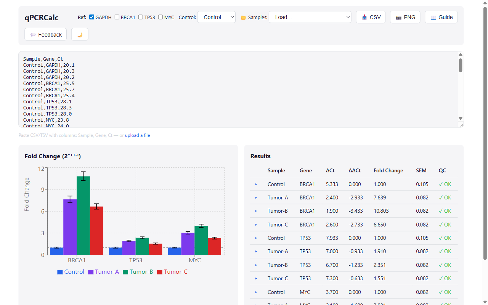

# qPCRCalc

**Vendor-agnostic ΔΔCt fold-change analysis in your browser.**

Replace instrument-locked vendor software with a free, open-source web tool for qPCR relative quantification using the Livak & Schmittgen (2001) method.



---

## Features

- **Paste or upload** raw Ct data (Sample | Gene | Ct)
- **Automatic replicate detection** — same Sample + Gene rows are grouped
- **Multi-reference gene support** — geometric mean normalization
- **ΔCt → ΔΔCt → fold change** pipeline in one click
- **Fold-change bar chart** with SEM error bars (Recharts)
- **QC flags** — high replicate CV%, low-signal Ct > 35, undetermined wells
- **Sortable results table** with ΔCt, ΔΔCt, fold change, SEM, and flags
- **CSV export** of the full results table
- **Light / dark theme**

## Quick Start

```bash
# Prerequisites: Node.js ≥ 18, pnpm
pnpm install
pnpm dev          # http://localhost:5173
```

1. Paste Ct data into the grid (or upload a CSV).
2. Select your **reference gene(s)** and **control group**.
3. Click **Analyze** — results table and bar chart appear instantly.
4. Export as CSV or download the chart.

Run the engine tests:

```bash
pnpm test
```

## Key Equations

| Step | Formula |
|------|---------|
| **ΔCt** | `Ct_target − Ct_reference` |
| **ΔΔCt** | `ΔCt_sample − mean(ΔCt_control)` |
| **Fold change** | `2^(−ΔΔCt)` |
| **Error bars** | `SEM = SD / √n`; bounds = `2^(−(ΔΔCt ± SEM))` |

Reference: Livak KJ & Schmittgen TD (2001). *Methods*, 25(4), 402–408.

## Tech Stack

| Layer | Technology |
|-------|------------|
| Engine | TypeScript, Vitest |
| Web UI | React, Vite, Recharts |
| Monorepo | pnpm workspaces |

## Project Structure

```
qpcrcalc/
├── packages/
│   ├── engine/          # Pure-TS analysis library
│   │   └── src/
│   │       ├── parser.ts      # Ct data parser (paste / CSV)
│   │       ├── stats.ts       # Replicate grouping, mean, SEM, geometric mean
│   │       ├── analysis.ts    # ΔCt, ΔΔCt, fold change, QC flags
│   │       ├── export.ts      # CSV export
│   │       ├── types.ts       # CtRecord, ReplicateGroup, DeltaCtResult, …
│   │       └── index.ts       # analyze() pipeline entry point
│   └── web/             # React + Vite frontend
│       └── src/
│           ├── components/
│           │   ├── DataEntry.tsx
│           │   ├── FoldChangeChart.tsx
│           │   ├── ResultsTable.tsx
│           │   └── Toolbar.tsx
│           ├── App.tsx
│           └── main.tsx
├── package.json
├── pnpm-workspace.yaml
└── PLAN.md
```

## License

MIT
